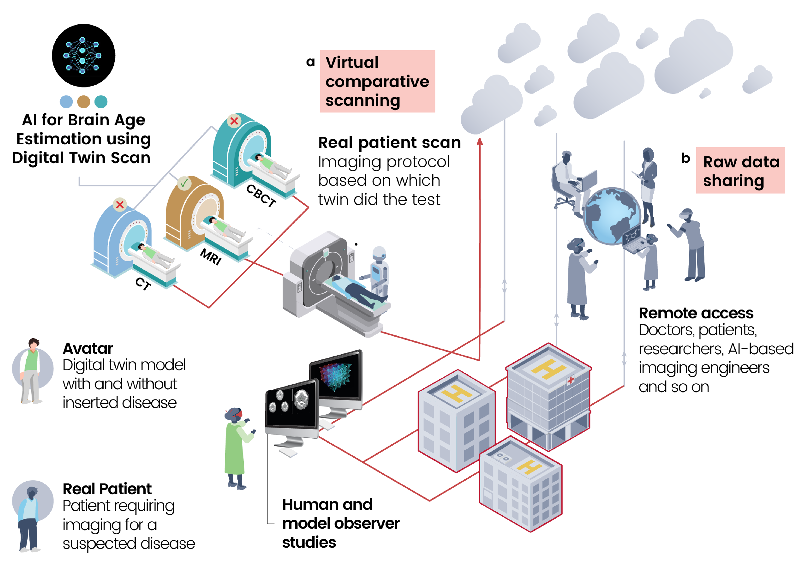
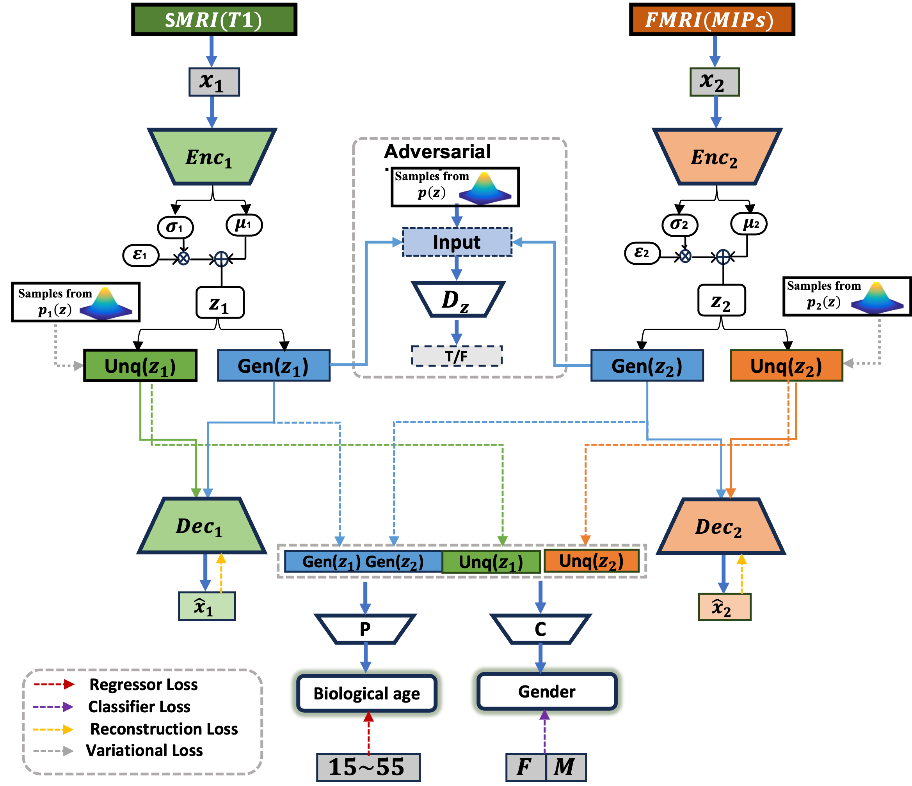

# **Brain Age Estimation using Multimodal MRI Data with Multi-Task Adversarial Variational Autoencoder (M-AVAE)**

This project focuses on predicting biological brain age using multimodal MRI data (sMRI and fMRI) while also incorporating gender prediction as an auxiliary task. We introduce a novel Multi-Task Adversarial Variational Autoencoder (M-AVAE), which leverages adversarial and variational learning techniques to disentangle shared and unique information from multimodal data, enhancing the accuracy and robustness of brain age estimation.

---

## **Table of Contents**
- [Introduction](#introduction)
- [Methodology](#methodology)
- [Results](#results)
- [Installation](#installation)
- [Usage](#usage)
- [Model Architecture](#model-architecture)
- [Performance Comparison](#performance-comparison)
- [License](#license)
- [Contact](#contact)

---

## **Introduction**

The **metaverse**, combining physical and virtual realities, is set to revolutionize healthcare through advancements in artificial intelligence (AI), virtual reality (VR), augmented reality (AR), and high-speed internet. Particularly in the realm of neuroimaging, the metaverse provides an innovative platform for medical diagnostics, such as **brain age estimation**, a crucial biomarker for identifying neurodegenerative diseases like Alzheimer's Disease (AD). 

One transformative application within the metaverse is the **digital twin**, a real-time virtual replica of a patient continuously updated with data from wearables, imaging, and electronic health records. This digital twin enables continuous health monitoring and predictive diagnostics. Integrating brain age estimation into a patient's digital twin allows dynamic neurological health assessments, providing personalized treatment strategies and early intervention for diseases like Alzheimer’s.


*Figure: A metaverse-based healthcare AI system using a digital twin for brain age estimation and secure data sharing.*

Brain age estimation algorithms predict the biological age of the brain using neuroimaging data like structural MRI (sMRI) and functional MRI (fMRI), offering insights into aging-related pathologies. However, challenges remain when fMRI data is incorporated, given the complexity of functional connectivity measurements. To address these challenges, we introduce the **Multitask Adversarial Variational Autoencoder (M-AVAE)**—a cutting-edge deep learning model that integrates multimodal data from sMRI and fMRI, along with multitask learning, to improve brain age predictions.

Our framework introduces two key innovations:
1. **Latent Variable Disentanglement**: Separation of generic and unique features from each modality to isolate shared and modality-specific attributes.
2. **Multitask Learning**: Leveraging **sex classification** as an auxiliary task to account for sex-related brain aging differences.

Evaluated on the **OpenBHB dataset**, a comprehensive brain MRI collection, the M-AVAE outperforms traditional methods with a **Mean Absolute Error (MAE)** of 2.77 years. This positions our framework as an ideal tool for brain health applications in **metaverse-based healthcare**.

---
### **2. Proposed Model: M-AVAE**

We propose the **Multitask Adversarial Variational Autoencoder (M-AVAE)** for brain age estimation, combining adversarial learning and variational autoencoders to fuse sMRI and fMRI data. The model's unique feature lies in disentangling latent features from each modality into **generic** (shared) and **unique** (modality-specific) components, improving the representation of brain structure and functionality.

- **Input Features**: sMRI captures structural brain data, while fMRI reflects functional connectivity.
- **Output**: The model predicts brain age and classifies the subject's gender.
  
**Key components**:
- **Latent Variable Disentanglement**: Separate encoder branches for sMRI and fMRI to isolate shared and modality-specific information.
- **Multitask Learning**: Simultaneous learning of brain age and gender prediction.

**Training Strategy**: The M-AVAE was trained on **3,984 scans** from the OpenBHB dataset, with the model designed to leverage both adversarial learning for latent space regularization and variational autoencoders to impose prior distributions on latent variables.


*Figure: The M-AVAE model architecture for brain age and gender prediction using multimodal MRI data.*

---

## **Results**

### Comparison with State-of-the-Art Methods**

We evaluated the performance of our M-AVAE model against several regression models, including **Random Forest (RF)**, **Support Vector Regression (SVR)**, **Gaussian Process Regression (GPR)**, and traditional **Adversarial Autoencoders (AAE)**. M-AVAE outperformed all comparison methods, achieving an **MAE of 2.77 years**.

| **Method**       | **MAE** | **RMSE** | **PCC**  |
|------------------|---------|----------|----------|
| **Random Forest** | 4.96 ± 3.00 | 5.80 ± 4.27 | 0.65 ± 0.29 |
| **SVR**           | 4.46 ± 2.82 | 5.28 ± 4.04 | 0.69 ± 0.25 |
| **AAE**           | 3.13 ± 1.85 | 3.63 ± 2.18 | 0.80 ± 0.14 |
| **M-AAE**         | 3.13 ± 1.98 | 3.70 ± 2.17 | 0.81 ± 0.12 |
| **M-AVAE**        | **2.77 ± 1.57** | **3.19 ± 1.90** | **0.82 ± 0.13** |

*Table: Comparison of the brain age estimation performance (MAE, RMSE, and PCC) across methods.*

---

## **Usage**

### **1. Setup and Installation**

1. **Clone the repository**:
    ```bash
    git clone https://github.com/yourusername/brain-age-prediction.git
    cd brain-age-prediction
    ```

2. **Install dependencies**:
    Ensure you have Python 3.8 or above installed. Use the following command to install all required packages:
    ```bash
    pip install -r requirements.txt
    ```
---

### **2. Prepare Your Data**

The model expects **two sets of features** (likely from structural MRI (sMRI) and functional MRI (fMRI)) in the form of NumPy arrays read from numpy files. 

### **3. Training the Model**

1. **Prepare Training Data**:
   Ensure the following NumPy files exist in the root directory:
   - `features1.npy`: First modality's features (e.g., sMRI data).
   - `features2.npy`: Second modality's features (e.g., fMRI data).
   - `labels_Age.npy`: Ground truth ages.
   - `labels_Gender.npy`: Ground truth genders.

2. **Run the Training Script**:
    ```bash
    python train.py
    ```

   The model will train using the provided datasets and automatically save checkpoints and performance logs.

---

### **4. Testing the Model**

1. **Prepare Testing Data**:
   Convert your test brain scans (sMRI and fMRI) into NumPy files similar to the training data.
   - `Test_features1.npy`: First modality features (sMRI).
   - `Test_features2.npy`: Second modality features (fMRI).
   - `Test_labels_Age.npy`: Ground truth age labels for test data.
   - `Test_labels_Gender.npy`: Ground truth gender labels for test data.

2. **Run the Testing Script**:
    ```bash
    python test.py
    ```

   This will run the trained model on the test data, output the predictions, and print evaluation metrics (e.g., accuracy, F1 score, precision, recall).

---

### **5. Inference with New Data**

If you have new data (sMRI and fMRI scans) and want to perform inference (predict age and gender):

1. **Prepare New Data**:
   Ensure your data is preprocessed and converted into NumPy arrays (`feature1.npy` and `feature2.npy`).

2. **Run Inference**:
    ```bash
    python main.py feature1.npy feature2.npy
    ```

   This will load the model and print predicted age and gender to the console.

---

### **6. Expected Output**

- **Predicted Age**: The model will output the predicted biological age.
- **Predicted Gender**: The model will output the predicted gender (e.g., 0 for male, 1 for female).
  
---

### **7. Evaluating the Model Performance**

To evaluate model performance based on your predictions, you can use the utility function `print_quant_measures`:

```python
from utils import print_quant_measures
print_quant_measures(Predicted_age, Inferenced_age, Predicted_Gender, Inferenced_Gender)
```

This will print accuracy, F1 score, precision, and recall for both age and gender predictions.


